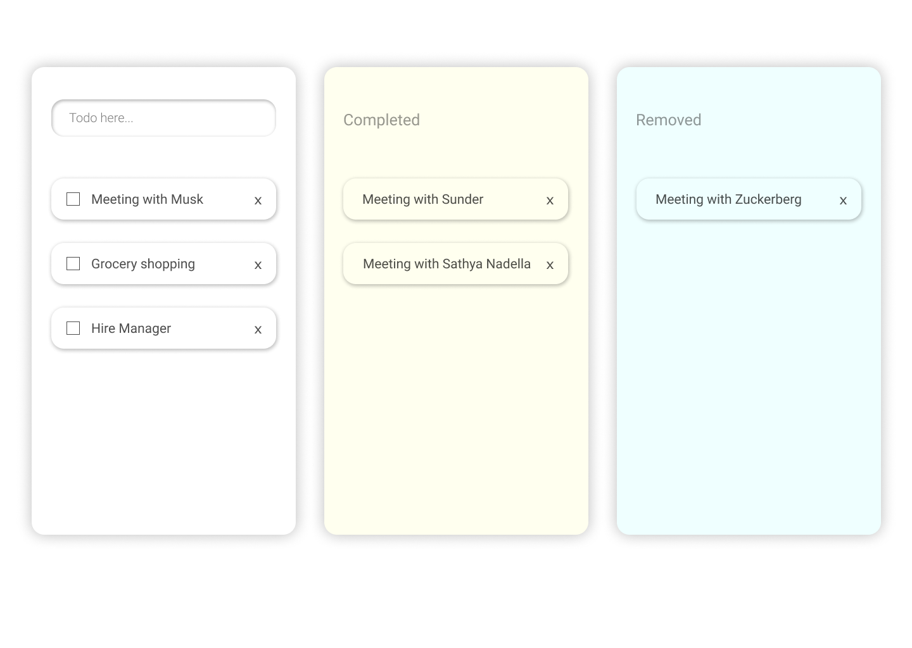

<h2>How to Use:</h2>
1. Enter todo in the input bar available in top of the 'first box'. 
2. On completion of the task click checkbox `✅` and the task moves to the 'completed box'. 
3. If checked by mistake uncheck `⬜` from completed task and task returns to the 'first box'. 
4. To remove the task click `x` icon at right side of the task, task moves to the 'removed box'. 
5. To delete the task click `delete` button at right side of task in the 'remove box'. 
