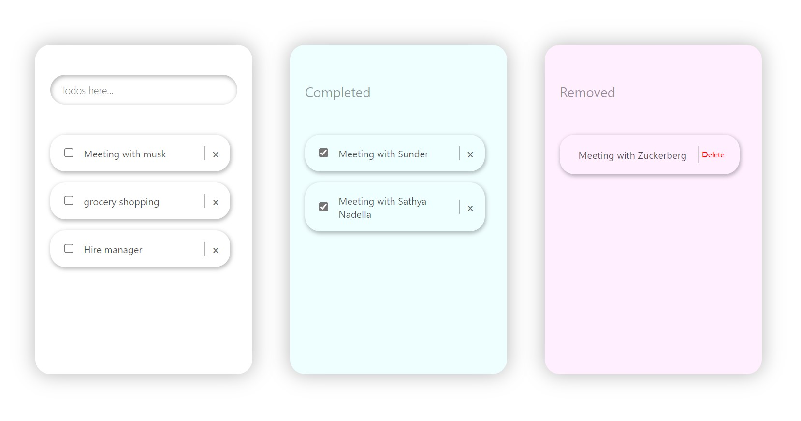

#### Try the app: `[App Link](https://60a6534c76dabf30e79710a4--eager-roentgen-23c027.netlify.app/)`
## How to Use:

1. Enter todo in the input bar available in top of the 'first box' and click `Enter` button on keyboard.
2. On completion of the task click checkbox `✅` and the task moves to the 'completed box'.
3. If checked by mistake uncheck `⬜` from completed task and task returns to the 'first box'.
4. To remove the task click `x` icon at right side of the task, task moves to the 'removed box'.
5. To delete the task click `delete` button at right side of task in the 'remove box'.
